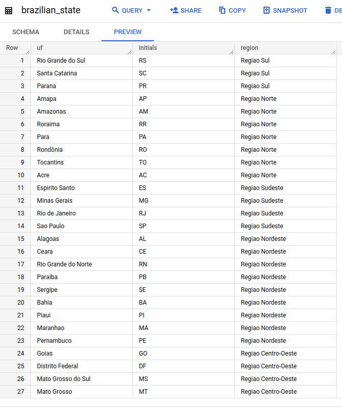
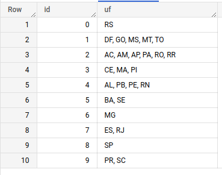

# :rocket: Desafio
Nosso time de negócio precisa verificar dados de uma API e além disso, analisar dados de alguns usuários para tomada de decisões futuras.

O desafio é capturar os dados que recebemos de alguns usuários e conseguir responder perguntas que definirão os próximos passos da empresa!
 
## Tarefas

### 1. Consumir dados de posts e users das APIs abaixo:

[JSONPlaceholder - POSTS](https://jsonplaceholder.typicode.com/posts)

[JSONPlaceholder - USERS](https://jsonplaceholder.typicode.com/users)

### 2. Preparar os dados para serem utilizados como dataframes do pandas:
Precisamos que os dados estejam formatados e com seu data type correto.

### 3. Estes dados serão enviados para uma tabela no GCP. O Google Cloud somente aceita nomes de tabelas separados por underscore. Preparar os dados para que estejam com este padrão, caso existam tabelas com múltiplos nomes;

### 4. Adicionar 2 novas colunas no dataframe, com os nomes de `dt_insert` e `candidate_name`: A primeira coluna deverá ser um campo com a data/hora atuais. A segunda coluna deverá ter o nome do candidato;

### 5. Agora, vc deverá consumir dados de usuário de um arquivo em JSON:
Importar os dados enviados no arquivo `data_begrowth.json` para posterior tratamento e inserção. Dados no formato **JSON**

Exemplo:
**Dados**
```
    {
      "id":1,
      "first.name":"Kellen",
      "last.name":"Cowherd",
      "email":"kcowherd0@nasa.gov",
      "gender":"Male",
      "utm":"br-gg-cc","cpf":"gAAAAABjieY90eD1zlPMbL92LLt-f6j5-apLacUZRGPncA9xDS99y1GunWtI9X2OfzMRsjDwNOk7Kya1Zd6l7WmcfJBUpqCIbw==",
      "address.geo_latitude":-28.2588438,
      "address.geo_longitude":-53.5009992,
      "address.country":"Brazil"
      }

```


| Campo                     | Descrição                                          |
| :------------------------ | :------------------------------------------------- |
| **ID**                    | identificador único do usuário                     |
| **first.name**            | primeiro nome do usuário                           |
| **last.name**             | último nome do usuário                             |
| **email**                 | email que o usuário cadastrou                      |
| **gender**                | gênero do usuário                                  |
| **address.geo_latitude**  | latitude de acesso do usuário                      |
| **address.geo_longitude** | longitude de acesso do usuário                     |
| **address.country**       | país de acesso do usuário                          |
| **utm**                   | define o fluxo de acesso (**vide legenda abaixo**) |
| **cpf**                   | CPF criptografado do usuário                       |


Para o campo **utm** (Urchin Traffic Monitor) temos os seguintes dominios validos, que sempre terá a estrutura [país]-[source]-[vertical]:

`br-gg-emp, br-gg-cc, br-gg-fin, br-fb-emp, br-fb-cc, br-wpp-fin`

**Legenda:**


| sigla  | País   |
| :----- | :----- |
| **br** | Brazil |


| sigla   | Source   |
| :------ | :------- |
| **gg**  | Google   |
| **fb**  | Facebook |
| **wpp** | WhatsApp |


| sigla   | Vertical          |
| :------ | :---------------- |
| **emp** | Emprestimo        |
| **cc**  | Cartão de Credito |
| **fin** | Financiamento     |


**Exemplo:**

O `utm = br-fb-emp` significa que o usuário pertence ao:
* País = br = Brazil
* Source = fb = Facebook
* Vertical = emp = Emprestimo


### 6. Transformar e tratar os dados em um dataframe com Python
Para ajudar o time de produto em suas análises, precisamos que os dados estejam formatados e com seu data type correto
 
**Regras de negócio**
* **6.1 -** Precisamos saber o estado que a pessoa acessou nossos serviços, com as coordenadas `address.geo_latitude` e `address.geo_longitude` dos usuários devemos criar uma coluna de estado chamada `address_state`, processo denominado [reverse geocode](https://en.wikipedia.org/wiki/Reverse_geocoding)
* **6.2 -** O arquivo contém o CPF do usuário, mas temos um problema: o CPF está **criptografado**! :lock: Utilizando a chave de criptografia **Fernet** passada por email, abra esse CPF para que possamos analisar o próximo requisito; :unlock:
* **6.3 -** Para ajudar a identificar registros mais atualizados e para nosso controle de auditoria, precisamos que o dataframe tenha as colunas `dt_insert` que contenha data/hora de inclusão do registro e `candidate_name` que contenha seu nome.
 
### 7. Inserir todos os dataframes dentro de tabelas no BigQuery
Deixamos os dados no jeitinho para que eles possam ser armazenados dentro de tabelas na nossa base de dados.
Utilizando a **service account** enviada por email crie tabelas no banco de dados com as seguintes nomenclaturas de exemplo:

**begrowth-user-api-demo.bg_users.nome_tabela_nome_do_candidato_dados_utilizados**

* **project_id =** begrowth-user-api-demo
* **dataset_id =** bg_users
* **table_id =** bg_data_enginner_test_nome_do_candidato_data_begrowth(para o arquivo data_begrowth.json )
* **table_id =** bg_data_enginner_test_nome_do_candidato_posts(para os dados consumidos pela API de posts)
* **table_id =** bg_data_enginner_test_nome_do_candidato_users(para os dados consumidos pela API de users)

**Ponto de atenção**: *Relembrando, o BigQuery não aceita colunas com ponto ou caracter especial, precisaremos renomear as colunas que contenham alguns desses casos trocando-os por *underscore* `_`*


Leia sobre [Nomes de coluna BigQuery](https://cloud.google.com/bigquery/docs/schemas#column_names) 


### 8. Utilizando consultas SQL responda as perguntas sobre os dados inseridos pelas APIs de posts e de users([Como executar consultas BigQuery com Python](https://cloud.google.com/bigquery/docs/pandas-gbq-migration#running_queries))

* **8.1 -** Criar queries, pesquisando as informações das tabelas de posts e users no BigQuery e retornando os nomes das respectivas colunas, os tipos de dados das colunas e se as colunas permitem a inserção de campos NULOS.([Introduction to INFORMATION_SCHEMA](https://cloud.google.com/bigquery/docs/information-schema-intro))
* **8.2 -** Escreva uma consulta SQL para selecionar todos os posts do userId 1.
* **8.3 -** Tendo a outra tabela users com id e name. Escreva uma consulta SQL para exibir todos os posts junto com o nome do usuário.
* **8.4 -** Como listar os usuários e seus websites, mas somente para aqueles que publicaram mais de 5 posts, contando a quantidade de posts publicados.
* **8.5 -** Como ordenar os usuários pela maior distância de um ponto geográfico específico, no caso a distância dos usuários de acordo com a sua latitude e longitude atual?([Descobrir as coordenadas ou pesquisar por latitude e longitude](https://support.google.com/maps/answer/18539?hl=pt-BR&co=GENIE.Platform%3DDesktop#:~:text=Ver%20as%20coordenadas%20de%20um,formato%20decimal%20na%20parte%20superior.))
 
### 9. Utilizando consultas SQL responda as perguntas sobre os dados inseridos pelo arquivo data_begrowth.json

* **9.1 -** Criar queries, pesquisando as informações da tabela criada pelo arquivo JSON no BigQuery e retornando os nomes das respectivas colunas, os tipos de dados das colunas e se as colunas permitem a inserção de campos NULOS.([Introduction to INFORMATION_SCHEMA](https://cloud.google.com/bigquery/docs/information-schema-intro))
* **9.2 -** Quantos **usuários** temos por **estado** de acesso ordenando pelo estado com maior número (coluna `address_state`)?
* **9.3 -** Quantos **usuários únicos** temos por **estado de acesso** ordenando pelo estado com maior número (coluna `address_state`)?
* **9.4 -** Quantos **usuários** temos por **source** ordando por ordem alfabética?
* **9.5 -** Quantos **usuários únicos** temos por **source** ordando por ordem alfabética?

:mag_right: Você sabia que o [nono dígito do CPF corresponde a Região Fiscal emissora do CPF](http://clubes.obmep.org.br/blog/a-matematica-nos-documentos-cpf/)? 

* **9.6 -** Sabendo disso, nosso time precisa saber qual a Região Fiscal que esse CPF foi registrado:


  Para isso disponibilizamos as tabelas:


  **9.6.1 -** `begrowth-user-api-demo.bg_users.brazilian_state` que contem as unidades federativas do Brasil e suas respectivas siglas
  


  **9.6.2 -** `begrowth-user-api-demo.bg_users.cpf_state` que contem o nono dígito do CPF e a Região Fiscal correspondente
  


* **9.7 -** O estado de acesso obtido atraves das coordenadas geograficas fica na mesma Região Fiscal que esse CPF foi registrado? (Criar flag `same_state` no select)
 
### 10. O que esperamos:
* Seu projeto deve estar em um repositório **git** com o código em arquivo Python e/ou Jupyter Notebook e os arquivos de *queries* que você utilizou na construção das suas análises.
* Crie uma documentação que explique como fez para chegar nos resultados obtidos, contendo as instruções para reproduzirmos suas análises, pode ser no **README** do git.
* Sinta-se à vontade para usar qualquer framework, bibliotecas e ferramentas que se sentir à vontade a única restrição é a linguagem de programação que deve ser **Python**

***Todos os dados de usuário são ficticios gerados para efeito de teste/estudo por plataformas como mockaroo e 4Devs**

**A má utilização dos dados aqui gerados é de total responsabilidade do usuário. Os dados são gerados de forma aleatória, respeitando as regras de criação de cada documento.**
